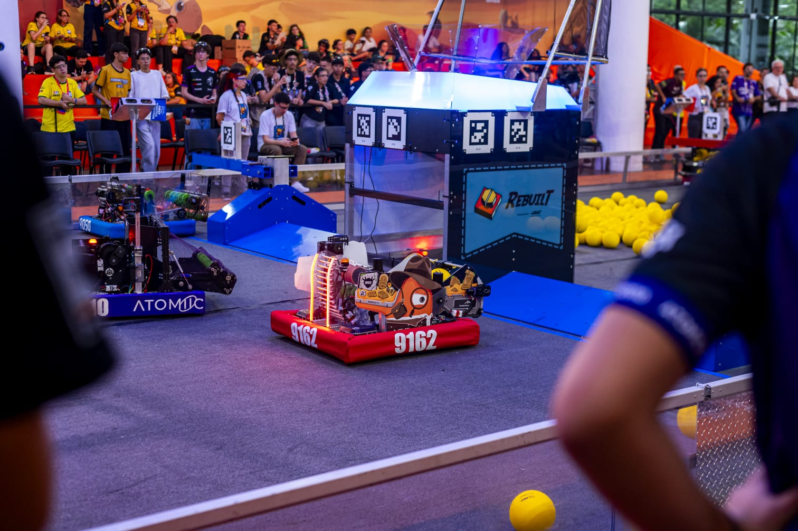

# SMASH 5.0 — FRC 9162

  

Codebase for **SMASH 5.0**, the development and training robot developed by **Team ALLMIGHT — 9162**.  
This version focuses on **vision-based shooting system using Limelight for distance estimation and linear interpolation to dynamically adjust shooter RPM **.

---

## Robot Overview

- **Team:** ALLMIGHT — 9162  
- **Robot Name:** SMASH 5.0  
- **Season:** 2026

---

## Highlights

### Control Architecture
- Command-based structure with swerve as default command  
- Cubic joystick scaling for improved low-speed precision  
- Hybrid control: manual driving with vision-assisted correction  
- Clear separation between driver, operator, and autonomous logic

---

### Vision & Localization
- Dual **Limelight** setup (front and rear)  
- AprilTag detection for alignment and targeting  
- Real-time distance estimation for scoring  
- Vision-assisted lateral correction during approach  
- Integrated with odometry for improved pose estimation  

---

## Shooting System
- Vision-based distance calculation using **Limelight**  
- **Linear interpolation** to dynamically adjust shooter RPM  
- Tuned shooting profiles based on empirical data  
- Focus on consistency and repeatability across distances     

---

## Mechanisms & Control
- PID + feedforward tuning for shooter and angulation systems  
- Output limits and brake modes for stability  
- Position tolerance checks for repeatable behavior  
- Emphasis on predictable and reliable mechanism response   

---

## Development Focus
- Improve pose estimation accuracy through sensor fusion  
- Refine swerve odometry and control loops  
- Enhance shooter accuracy with better interpolation modeling  
- Validate and expand vision-assisted automation  
- Establish a robust and scalable architecture for future seasons  

---

Developed by the **Team ALLMIGHT — 9162 Software Team**
- **[Rafael Henritzi](https://github.com/henritzi)**  
- **[Niord Miranda](https://github.com/ProgramadorNiord)**
